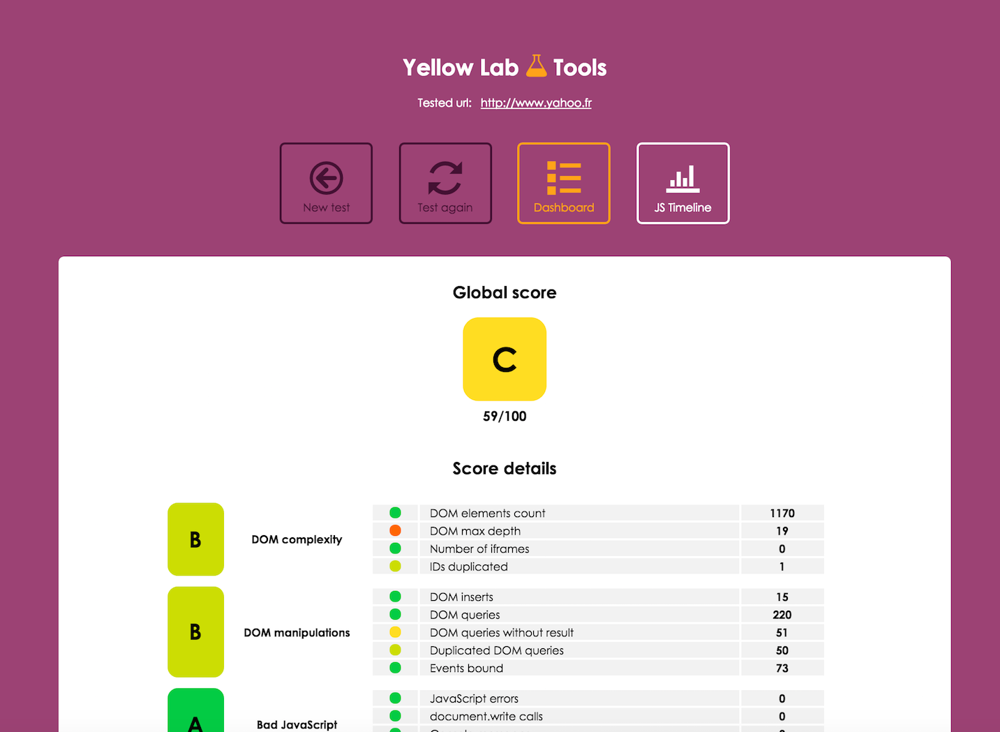

 

# Yellow Lab Tools

Online tool that lets you test a webpage and detects **performance** and **front-end code quality** issues.

### Access the tool here: [http://yellowlab.tools](http://yellowlab.tools)

## How it works

The tool loads the given URL via [PhantomJS](http://phantomjs.org/) (a headless browser) and collects various metrics and statistics with the help of [Phantomas](https://github.com/macbre/phantomas). These metrics are then categorized and transformed into scores. It also gives in-depth details so developpers can fix the detected issues.

By the way, it's free because we are geeks, not businessmen. All we want is a ★ on GitHub, it will boost our motivation to add more awesome features!!!

## Different ways to use YLT

#### The online tool:
This is **the best way** to discover the tool: [http://yellowlab.tools](http://yellowlab.tools).  
Please note the server is hosted in Baltimore, USA.

#### The Command Line Interface (CLI):
Might be useful if you want to build an automation tool. The documentation is [here](https://github.com/gmetais/YellowLabTools/wiki/Command-Line-Interface).

#### The NPM module:
Can be used to build automation tools in NodeJS. The documentation is [here](https://github.com/gmetais/YellowLabTools/wiki/NodeJS-module).

#### The public API:
Hosted on our http://yellowlab.tools server, it is a RESTful API that allows you to launch distant tests. The documentation is [here](https://github.com/gmetais/YellowLabTools/wiki/Public-API).

#### The Grunt task:
If you have a Continuous Integration platform, may I suggest you to use [grunt-yellowlabtools](https://github.com/gmetais/grunt-yellowlabtools)? You set it up once, then the task fails if the front-end quality conditions you defined are not met.

## Test your localhost

You can use [ngrok](https://ngrok.com/), a tool that creates a secure tunnel between your localhost and the online tool (or the public API). You can also use the CLI or the Grunt tasks as they run on your machine.

## Install your own private instance

If your project is not accessible from outside, or if you want to fork and improve the tool, you can build your own instance. The documentation is [here](https://github.com/gmetais/YellowLabTools/wiki/Install-your-private-server).

## Help needed!
There are so many things left to do, **your help would be greatly appreciated**! Please report bugs, ask for evolutions and come code with me.

## License
Please read the [license](LICENSE). Icons are the property of [IcoMoon.io](https://icomoon.io/)

## Author
Gaël Métais. I'm a webperf freelance based in Paris. If you understand French, you can visit [my website](http://www.gaelmetais.com).

## Contributors
- Achraf Ben Younes [achrafbenyounes](https://github.com/achrafbenyounes)

