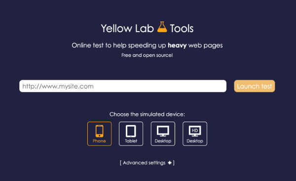
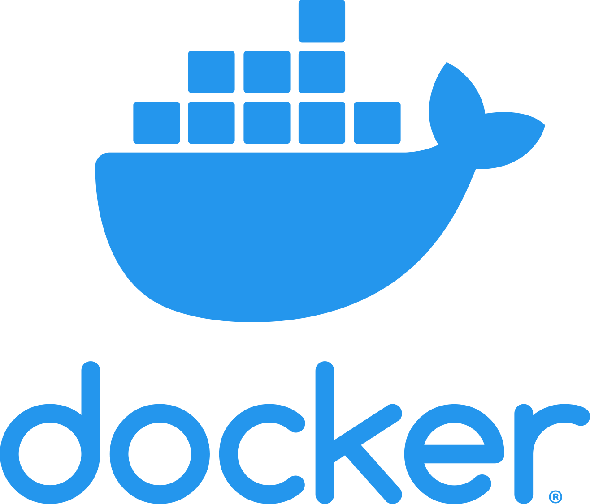
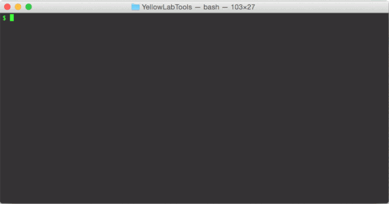
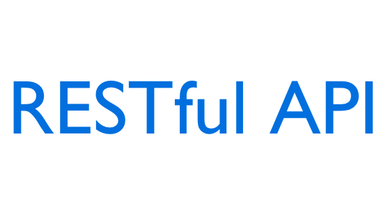
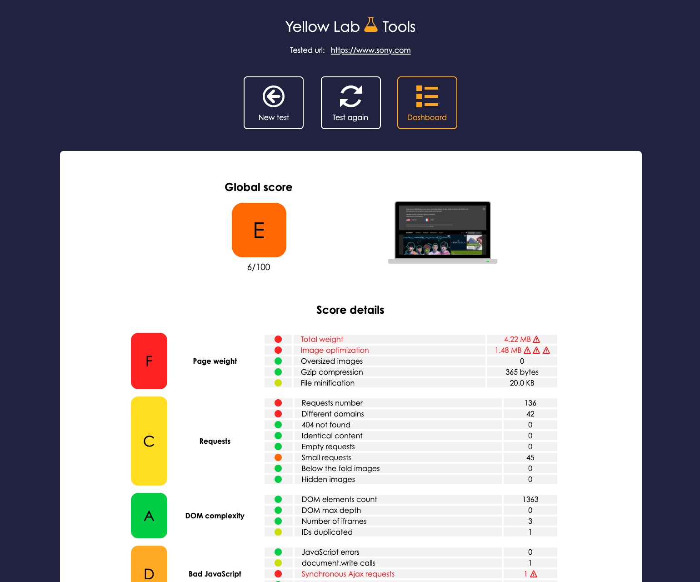

</img>

Analyzes a webpage and detects **performance** or **front-end code quality** issues. Free, easy to launch, easy to understand, in-depth details.

#  

</img>

<table>
    <tr>
        <td width="70%">
            The <b>online tool</b> (recommended): 
            <a href="https://yellowlab.tools" target="_blank">https://yellowlab.tools</a>
        </td>
        <td width="30%">
            </img>
        </td>
    </tr>
    <tr>
        <td width="70%">
            The <b>Docker image</b> - <a href="https://github.com/ousamabenyounes/docker-yellowlabtools" target="_blank">ousamabenyounes/docker-yellowlabtools</a>
             
            Your own private instance of Yellow Lab Tools, on your computer.
        </td>
        <td width="30%">
            </img>
        </td>
    </tr>
    <tr>
        <td width="70%">
            The <b>CLI</b> (Command Line Interface) - <a href="https://github.com/YellowLabTools/YellowLabTools/wiki/Command-Line-Interface" target="_blank">Doc here</a>
        </td>
        <td width="30%">
            </img>
        </td>
    </tr>
    <tr>
        <td width="70%">
            The <b>NodeJS</b> package - <a href="https://github.com/YellowLabTools/YellowLabTools/wiki/NodeJS-module" target="_blank">Doc here</a>
        </td>
        <td width="30%">
            </img>
        </td>
    </tr>
    <tr>
        <td width="70%">
            The <b>public API</b> - <a href="https://github.com/YellowLabTools/YellowLabTools/wiki/Public-API" target="_blank">Doc here</a>
             
            Allows you to launch runs from any language
        </td>
        <td width="30%">
            </img>
        </td>
    </tr>
</table>

## How it works

The tool loads the given URL and collects various metrics and statistics with the help of [Phantomas](https://github.com/macbre/phantomas). These metrics are then categorized and transformed into scores. It also gives in-depth details so developpers can fix the detected issues.

By the way, it's free because I am a geek, not businessmen. In return, you can add a ★ on GitHub, it will boost my motivation to add more awesome features!!!

## Install your own private instance

If your project is not accessible from outside or if you want to test your localhost, you might want to run your own instance of Yellow Lab Tools.

The classical way is to clone the YLT server's GitHub repository and run it on Linux or MacOS. The documentation is [here](https://github.com/YellowLabTools/YellowLabTools/wiki/Install-your-private-server).

The new recommended solution is to run Yellow Lab Tools inside a Docker virtual machine. My friend Ousama Ben Younes maintains [this ready-to-use Docker image based on Alpine](https://github.com/ousamabenyounes/docker-yellowlabtools)).

## Author
Gaël Métais. I'm a webperf freelance. Follow me on Twitter [@gaelmetais](https://twitter.com/gaelmetais), I tweet about Web Performances, Front-end and new versions of Yellow Lab Tools!

<a href='https://ko-fi.com/gaelmetais' target='_blank'><a>

I can also help your company about Web Performances, visit [my website](https://www.gaelmetais.com).

## Contributors
- Achraf Ben Younes [achrafbenyounes](https://github.com/achrafbenyounes)
- Km [camlafit](https://github.com/camlafit)
- Vincent L. [magikcypress](https://github.com/magikcypress)
- Ousama Ben Younes [ousamabenyounes](https://github.com/ousamabenyounes)

