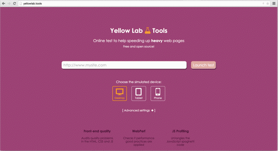

</img>

Useful tool that analyzes a webpage and detects **performance** and **front-end code quality** issues.


### Choose your way to use the tool:

<table>
<tr>
<td width="70%">
The online tool (recommended)  
[http://yellowlab.tools](http://yellowlab.tools)
</td>
<td width="30%">
</img>
</td>
</tr>
<tr>
<td width="70%">
The CLI (Command Line Interface) - [doc here](https://github.com/gmetais/YellowLabTools/wiki/Command-Line-Interface)  
```npm install yellowlabtools -g```
</td>
<td width="30%">
</img>
</td>
</tr>
<tr>
<td width="70%">
The Grunt task for developers or Continuous integration
Visit [gmetais/grunt-yellowlabtools](https://github.com/gmetais/grunt-yellowlabtools)
</td>
<td width="30%">
</img>
</td>
</tr>
<tr>
<td width="70%">
The NPM package - [doc here](https://github.com/gmetais/YellowLabTools/wiki/NodeJS-module)  
```npm install yellowlabtools```
</td>
<td width="30%">
</img>
</td>
</tr>
<tr>
<td width="70%">
The public API - [doc here](https://github.com/gmetais/YellowLabTools/wiki/Public-API)  
Allows you to launch runs in a RESTful way
</td>
<td width="30%">
<h3>REST</h3>
</td>
</tr>
</table>


## How it works

The tool loads the given URL via [PhantomJS](http://phantomjs.org/) (a headless browser) and collects various metrics and statistics with the help of [Phantomas](https://github.com/macbre/phantomas). These metrics are then categorized and transformed into scores. It also gives in-depth details so developpers can fix the detected issues.

By the way, it's free because we are geeks, not businessmen. All we want is a ★ on GitHub, it will boost our motivation to add more awesome features!!!


## Test your localhost

You can use [ngrok](https://ngrok.com/), a tool that creates a secure tunnel between your localhost and the online tool (or the public API). You can also use the CLI or the Grunt tasks as they run on your machine.


## Install your own private instance

If your project is not accessible from outside, or if you want to fork and improve the tool, you can build your own instance. The documentation is [here](https://github.com/gmetais/YellowLabTools/wiki/Install-your-private-server).


## Help needed!
There are so many things left to do, **your help would be greatly appreciated**! Please report bugs, ask for evolutions and come code with me.


## License
Please read the [license](LICENSE). Icons are the property of [IcoMoon.io](https://icomoon.io/)


## Author
Gaël Métais. I'm a webperf freelance based in Paris. If you understand French, you can visit [my website](http://www.gaelmetais.com).


## Contributors
- Achraf Ben Younes [achrafbenyounes](https://github.com/achrafbenyounes)

